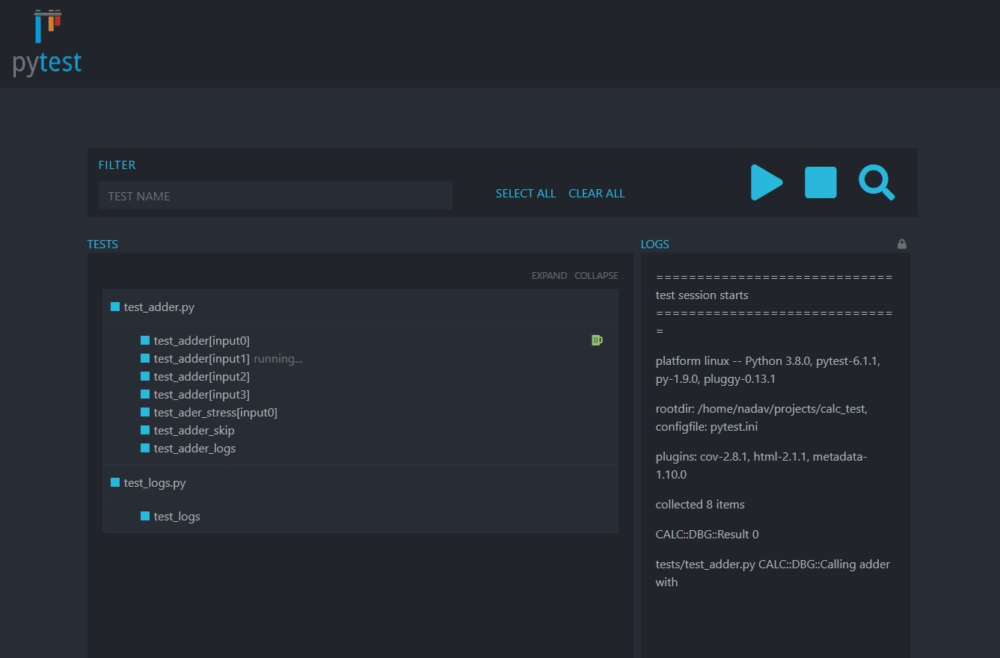

# Pytest GUI

Pytest GUI introduces a web preview of your tests.


## Features

- Discovering and collecting tests.
- Select test to run.
- Running and stopping tests.
- Live log view.
- Report directory that contains test history.

## Getting started

The project is currently not on pip so follow the build guide or download the uploaded release.

### Usage

```sh
pytest-gui <test-dir>
```

### Environment variables

Pytest GUI supports a couple of environment variables.

1. `PYTEST_GUI_LOG_LEVEL` - Loggers logging level supports python `logging` package level values. (Default: info)
2. `PYTEST_GUI_REPORT_DIR` - Report directory to save log history. (Default: '.reports')
3. `PYTEST_GUI_TEST_DIR` - Test directory this value is overwritten by command line argument if given. (Default: '.')
4. `PYTEST_GUI_PYTEST` - Command to run to initiate pytest. (Default: 'pytest')

## Build

This package utilizes the Pipenv tool to containerize the dependencies. To support python2 the plugin and gui module are separate packages:

- pytest_gui_plugin - Supports Python 2.7
- pytest_gui - Supports Python 3.7

3. Install dependencies `pipenv install --dev`.
4. Run `npm i` in the frontend directory to install required npm packages.
5. Run the `vscode` task `Build all` (or follow it).
6. cd to `pytest_gui/pytest/pytest_gui_plugin/pytest_gui_plugin` and run `python setup sdist` there as well to build plugin.

## License

[MIT](https://github.com/ned3144/pytest-gui/blob/main/LICENSE)
